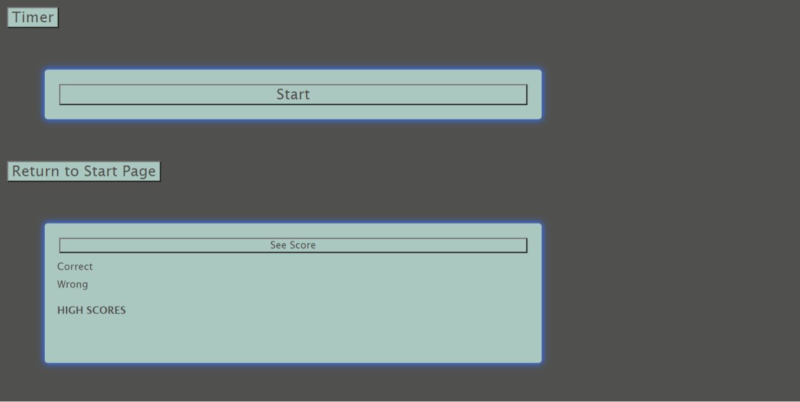

# Code Quiz

## Assignment

In this assignment, I created a coding quiz based off of the knowledge that I have learned in my course so far. The quiz includes two HTML pages. The first page is a welcoming page that is interactive and includes a button to push you to the questions page. 

From there you can hit the start button, where the questions will be displayed in a randomized order. At the bottom of the page you should see your updated score. Once you have answered all the questions, there is an alert at the top of the page that directs you to hit the "see score" button. Where you can upload your score to compete with your friends.

## Screenshot of My Final Page

## Link to my Final Page

## Attributions

I used two main resources for help in the homework. This first was a youtube video from someone in the industry creating a highly simplified version of our game quiz. .

The second resources that I used was a website shared by my classmates on our group chat. 

